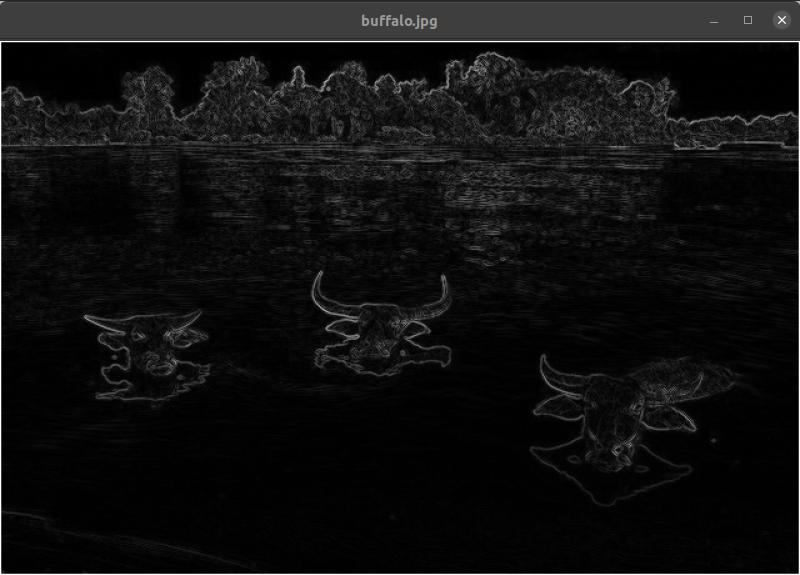

# Content-aware image resizing with C++

- Uses OpenCV
- Opens images and removes the "least important" horizontal or vertical seam of pixels with seam carving

## Usage
- Make sure OpenCV is installed
   - e.g. `sudo apt install libopencv-dev` on Ubuntu/Debian
- ```
  $ mkdir build
  $ cd build
  $ cmake ..
  $ make
  $ cd ..
  ```
- ```
  $ build/content_aware_image_resize
  Usage: build/content_aware_image_resize [options] IMAGE_FILENAME
  -h, --help
  Show this help message
  -t, --energy-type
  Energy calculation type (0 or 1)
  -e, --energy-image
  Only show energy image
  -s, --sample-run
  Only do sample run
  ```
- When an image is opened, you can
  - remove vertical seams with the Left or Right key
  - remove horizontal seams with the Up or Down key
  - toggle marking the seams in red with `r`
  - quit with `q` or Escape
## Examples
- `$ build/content_aware_image_resize -e buffalo.jpg`
  
- `$ build/content_aware_image_resize buffalo.jpg` and repeated removal of vertical seams with left/right key
  

## References
- Pictures:
    - https://commons.wikimedia.org/wiki/File:Three_buffaloes_heads_above_water_in_Si_Phan_Don.jpg
    - https://pixy.org/4670539/
- Algorithms, [Part II](https://www.coursera.org/learn/algorithms-part2/home/welcome) by Princeton Univers    ity (Robert Sedgewick, Kevin Wayne)